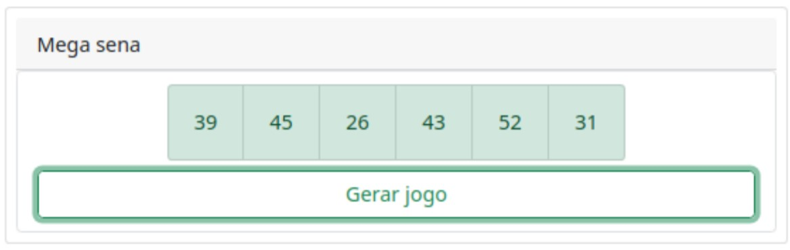
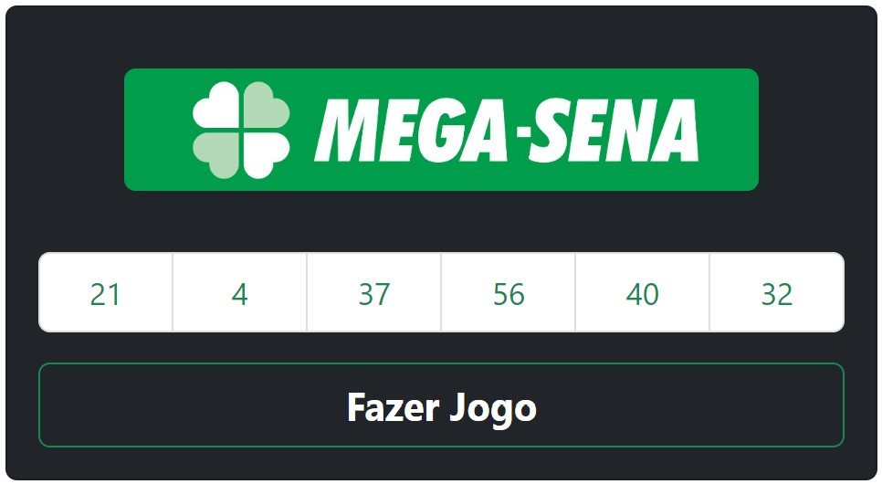

# Programação para Dispositivos Móveis
## 5º Semestre do curso de *Análise e Desenvolvimento de Sistemas*
## React Componentes Usando Classes
# Exercício 3 - React - Jogo da Mega Sena

Crie uma aplicação ReactJS que gera um jogo da Mega Sena para o usuário. Ela deve possuir um campo em que o jogo é exibido e um botão que dispara o algoritmo quando clicado. Os valores sorteados devem ser armazenados em uma lista pertencente ao estado do componente. A aplicação pode ser semelhante a Figura 1.1.

## Desafio:  
### Faça uso dos componentes da biblioteca React Bootstrap. 
### Visite o abaixo para encontrar a sua documentação oficial.
### https://react-bootstrap.github.io/
### npm install react-bootstrap bootstrap
#
# Resultado do exercício

